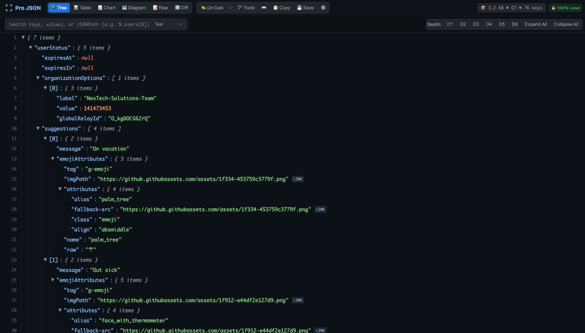
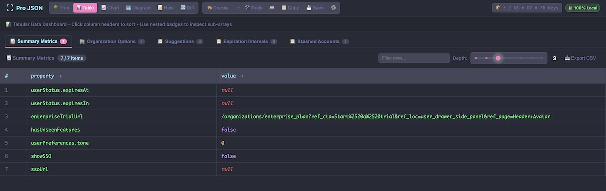
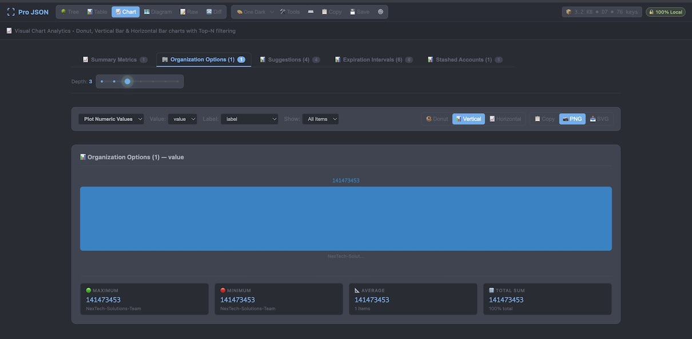
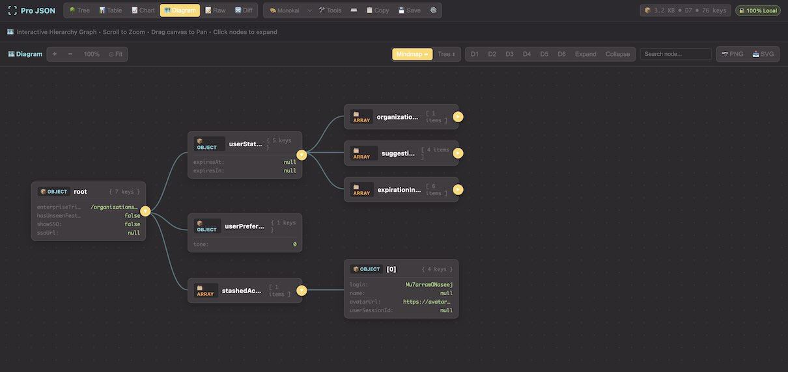
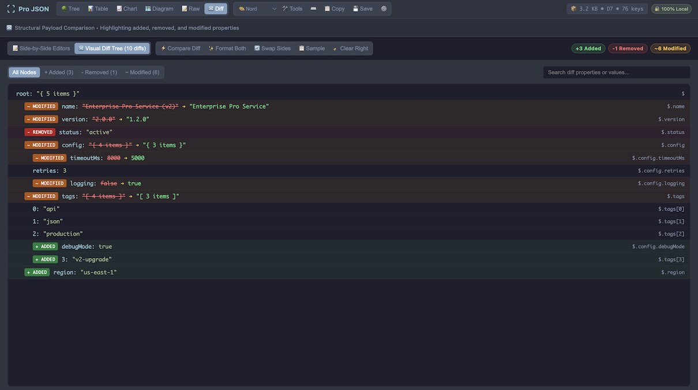

# Pro JSON Viewer — Next-Gen Browser Extension 🚀

[](https://developer.chrome.com/docs/extensions/mv3/intro/)
[](https://www.typescriptlang.org/)
[](https://vitest.dev/)
[](https://github.com/mu7arram/pro-json-viewer)
[](LICENSE)

**Pro JSON Viewer** is a high-performance, private, and developer-centric Chrome extension built with Manifest V3 and TypeScript. It transforms raw API responses, complex JSON payloads, and local `.json` files into an interactive, multi-view inspection suite with zero lag, instant search, visual analytics, and offline privacy.

---



---

## 🌟 Key Features & View Modes

### 🌳 1. Interactive Tree View & Smart Decoders
- **Contextual Adaptive Toolbar**: Dynamic depth buttons (`D1..D{max}`, `Expand All`, `Collapse All`) automatically calculate the exact depth of the document.
- **Deep Search & JSONPath**: Real-time filtering supporting plain text, regular expressions, and live JSONPath evaluation (e.g., `$.items[*].price`).
- **Smart Inline Decoders**:
  - **JWT Inspector**: Auto-detects and decodes JWT tokens inline.
  - **Timestamp Formatter**: Converts Unix timestamps and ISO dates to readable local/UTC strings on hover.
  - **Color Previews & Links**: Renders inline color pickers for HEX/RGB values and makes URLs clickable.

---

### 📊 2. Smart Table View & Column Manager
Transform nested JSON collections and object arrays into rich, interactive data grids with one click.



- **Magnetic Deep Scanning**: Dynamically analyzes nested records up to custom scan depths.
- **Multi-Column Sorting & Filtering**: Instant alphanumeric sorting and column-specific searches.
- **Column Visibility Selector**: Toggle and hide properties dynamically.
- **Universal Data Export**: Export tables directly to **CSV**, **Excel (.xlsx)**, or filtered **JSON**.

---

### 📈 3. Visual Chart Studio & Analytics
Visualize numeric metrics, categorical distributions, and key frequencies directly inside your browser.



- **Multiple Chart Types**: Interactive **Bar Charts**, **Donut / Pie Charts**, and **Line Trends**.
- **Auto Numeric & Categorical Aggregation**: Automatically identifies numerical columns and summarizes counts and percentages.
- **Export Visuals**: Save generated charts as high-resolution **PNG** or vector **SVG** graphics.

---

### 🗺️ 4. Interactive Diagram & Mindmap Studio
Explore deeply nested hierarchies through an interactive visual canvas.



- **Dual Layout Engines**: Toggle between **Mindmap (Horizontal ⬌)** and **Tree Hierarchy (Vertical ⬍)** layouts.
- **Infinite Pan & Smooth Zoom**: Navigate large datasets with mouse drag and zoom controls.
- **Dynamic Node Expansion**: Expand nodes level by level or branch by branch.
- **Vector Export**: Export full high-resolution diagrams to **SVG** and **PNG**.

---

### 🔀 5. Full Dual-Editor Side-by-Side Diff Suite
A dedicated comparison studio to inspect changes between two JSON payloads.



- **Dual-Pane Workspace**: Left (Baseline) and Right (Target) text editors with live character and line counters.
- **Real-Time Syntax Validation**: Instant error pills and banners highlighting syntax errors before diffing.
- **Visual Diff Tree**: Expandable color-coded tree featuring **`+ Added` (green)**, **`- Removed` (red)**, and **`~ Modified` (amber)** with old $\rightarrow$ new value transitions.
- **Interactive Action Bar**: One-click **`✨ Format Both`**, **`🔄 Swap Sides`**, and **`📋 Sample Data`** loading.

---

### 🛠️ 6. Developer Tools & Schema Health Inspector
Instantly generate type definitions and validate schema consistency.

- **Type & Schema Code Generators**:
  - **TypeScript Interfaces** (`interface`, `type`)
  - **JSON Schema (Draft-07)**
  - **Python Pydantic Models**
  - **Go Structs**
- **Schema Health & Anomaly Detector**: Analyzes array collections to flag missing keys, type inconsistencies, null ratios, and structural anomalies.

---

### ⚡ 7. Web Worker Off-Thread Parser (50MB+ Support)
- Offloads heavy parsing and hierarchy indexing to a dedicated background Web Worker thread.
- Guarantees a responsive 60fps browser UI even with massive multi-megabyte payloads.
- Integrated progressive load indicator with live percentage feedback.

---

## ⌨️ Keyboard Shortcuts Cheat-Sheet

Press `?` or click **⌨️ Shortcuts** in the toolbar at any time to display the shortcut modal.

| Shortcut | Action |
| :--- | :--- |
| `Alt + 1` | Switch to **Tree View** |
| `Alt + 2` | Switch to **Table View** |
| `Alt + 3` | Switch to **Chart View** |
| `Alt + 4` | Switch to **Diagram View** |
| `Alt + 5` | Switch to **Raw View** |
| `Alt + 6` | Switch to **Diff Workspace** |
| `/` or `Ctrl/Cmd + F` | Focus **Search / JSONPath Bar** |
| `Alt + E` | **Expand All** Nodes |
| `Alt + C` | **Collapse All** Nodes |
| `Alt + T` | Open **Developer Tools Modal** |
| `?` | Show **Keyboard Shortcuts** |

---

## 🔒 100% Offline & Private

- **Zero Network Requests**: All parsing, decoding, diffing, and rendering executes completely offline in your browser context.
- **Zero Telemetry**: No tracking scripts, analytics, or third-party cookies.
- **Secure**: Strictly compliant with Chrome Manifest V3 security standards.

---

## 📦 Installation

### Load Unpacked (Development / Manual Install)
1. Clone or download this repository:
   ```bash
   git clone https://github.com/mu7arram/pro-json-viewer.git
   ```
2. Install dependencies and build the production bundle:
   ```bash
   npm install
   npm run build
   ```
3. Open Google Chrome (or any Chromium browser like Brave, Edge, Opera).
4. Navigate to `chrome://extensions`.
5. Toggle **Developer mode** on (top-right switch).
6. Click **Load unpacked** (top-left button) and select the project root folder.

---

## 🏗️ Project Architecture

```text
├── manifest.json              # Chrome Manifest V3 configuration
├── content.js                 # Injected content script & dual-runtime engine
├── service-worker.js          # Background lifecycle & context menus
├── theme.css                  # Modern HSL CSS variables & themes
├── src/
│   ├── engine/
│   │   ├── parser.ts          # Virtualized hierarchy builder & node flattener
│   │   ├── worker-parser.ts   # Web Worker off-thread parsing engine
│   │   ├── worker-bridge.ts   # Thread bridge with fallback handler
│   │   ├── schema-generator.ts# TypeScript/JSONSchema/Go/Python generator
│   │   ├── diff-engine.ts     # Deep structural diff algorithm
│   │   └── jsonpath.ts        # JSONPath evaluation engine
│   ├── ui/
│   │   ├── toolbar.ts         # 2-tier contextual adaptive toolbar
│   │   ├── tree-view.ts       # High-performance virtualized tree component
│   │   ├── table-view.ts      # Multi-column sortable table grid
│   │   ├── chart-view.ts      # Visual chart & analytics studio
│   │   ├── diagram-view.ts    # Interactive mindmap & hierarchy canvas
│   │   ├── diff-view.ts       # Dual-editor diff comparison workspace
│   │   └── tools-modal.ts     # Developer tools & schema health modal
│   ├── options/               # Options & Scratchpad UI
│   └── popup/                 # Quick toggles popup
└── tests/                     # 11 Vitest unit test suites (39 tests)
```

---

## 🧪 Testing

Run the Vitest test suite and TypeScript typechecker:
```bash
npm test          # Runs 11 test suites across parser, diff, schema, and views
npm run typecheck # Validates 0 TypeScript type errors
```

---

## 📄 License

This project is open-source software licensed under the **[MIT License](LICENSE)**.
