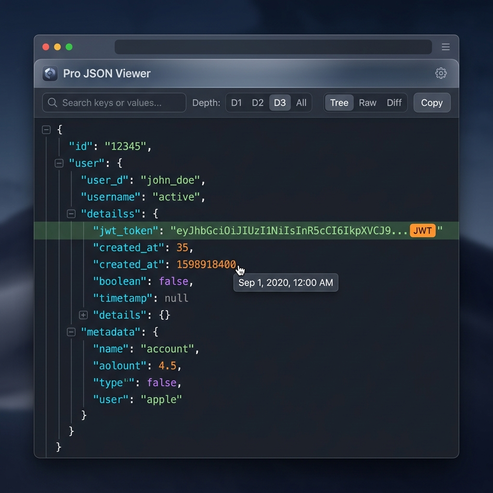

# Pro JSON Viewer — Browser Extension

Pro JSON Viewer is a high-performance, private, feature-rich browser extension built using Manifest V3. It transforms unformatted JSON responses, API payloads, and local `.json` files into an interactive, lightning-fast virtualized tree view.



---

## Key Features

### ⚡ 1. High-Performance Virtualization & Lazy Expansion
- Built with a windowed virtual scroll list manager to support massive payloads (**50MB+**) at a smooth **60fps**.
- Renders only the visible rows in the viewport, preventing the browser tab from freezing.
- Lazy child loading ensures nested structures are parsed and rendered only on expansion.

### 🔍 2. Real-Time Search & JSONPath Filtering
- **Text & Regex Search**: Search through keys and values instantly. Matches auto-expand parent nodes and highlight matched text.
- **JSONPath Query Bar**: Run live queries (e.g. `$.data.items[*].price`) to filter and navigate complex payloads dynamically.

### 💡 3. Smart Value Decoders & Schema Hints
- **JWT Decoder**: Auto-detects JWT tokens, offering an inline payload viewer.
- **Timestamp Converter**: Identifies unix timestamps and ISO date strings, showing formatted local/UTC date on hover.
- **Clickable URLs**: Detects URLs and turns them into clickable links.
- **Schema Anomaly Detection**: Automatically flags objects within arrays that have missing or inconsistent properties.

### 🔀 4. Structural Diff Mode
- Paste or load a secondary JSON document to see color-coded additions (green), removals (red), and modifications (yellow) relative to the primary document.

### 🔒 5. 100% Local & Private
- All parsing, decoding, searching, and diffing occurs completely offline in your browser.
- **Zero network requests, zero telemetry, and zero third-party calls.**

---

## Installation

### Load Unpacked (For Development / Manual Install)
1. Download or clone this repository.
2. Open Google Chrome (or any Chromium browser like Edge/Brave/Opera).
3. Navigate to `chrome://extensions`.
4. Enable **Developer mode** using the toggle in the top-right corner.
5. Click **Load unpacked** in the top-left corner.
6. Select the repository root folder (`json viewer`).

---

## File Structure

```text
├── manifest.json         # Extension manifest V3 metadata
├── service-worker.js     # Background lifecycle & context menus
├── content.js            # Injected content script & rendering engine
├── theme.css             # Modular HSL styling & dark/light modes
├── popup.html            # Extension popup widget
├── popup.js              # Popup script (quick toggles)
├── options.html          # Settings page & scratchpad UI
├── options.js            # Options script
├── icons/                # Extension branding icons
└── assets/               # README preview images
```

---

## License
MIT License. Free to use, modify, and distribute.
